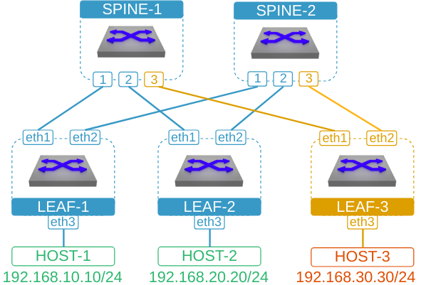
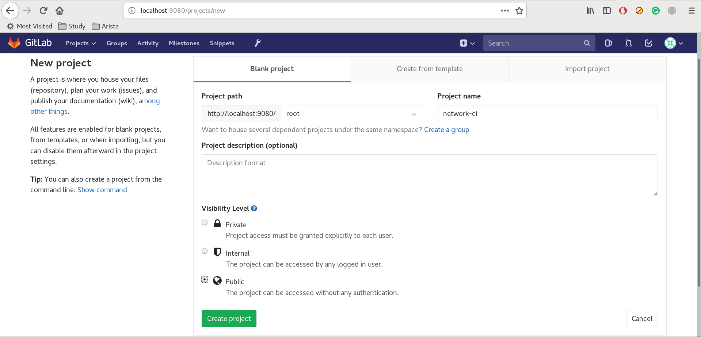
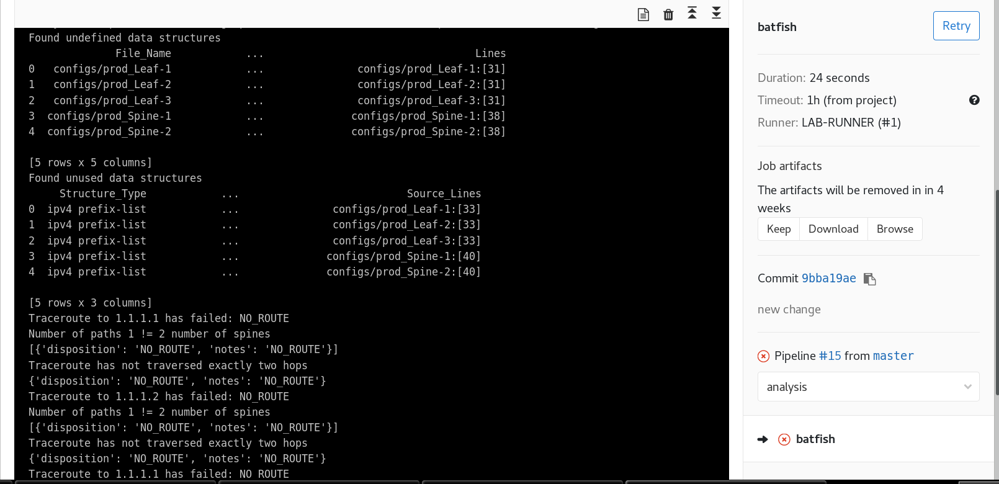
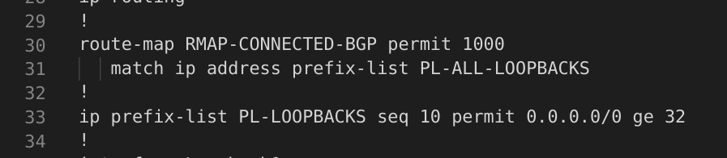
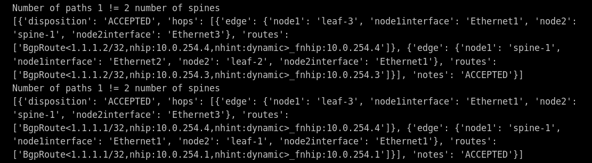
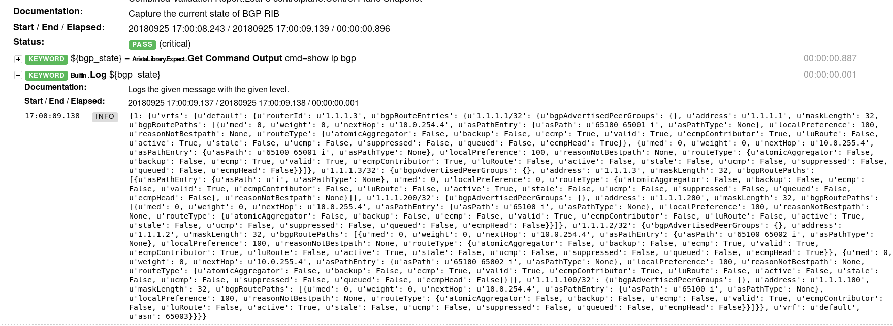
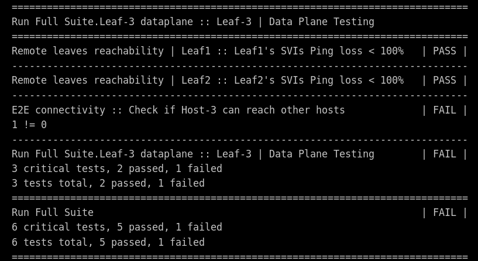

# A portable network CI demo with Gitlab, Ansible, cEOS, Robot Framework and Batfish

## Introduction

The goal of this project is to demonstrate the following:
1. Applicability of CI/CD principles to data centre networks
2. The use of Arista cEOS and [docker-topo](https://github.com/networkop/arista-ceos-topo) to build arbitrary network topologies
3. The use of [Batfish](https://github.com/batfish/batfish) to analyze network configurations and verify the expected control plane and data plane properties
4. The use of [Robot Framework](https://github.com/aristanetworks/robotframework-aristalibrary) for network testing and verification
5. The use of Ansible to generate complex network configurations from simple data models 
6. The use of Ansible to generate **diffs** for both network configurations and network state pre- and post-change

To achieve the above goals, I'll use the following topology:



We start with Leaf-1, Leaf-2, Spine-1 and Spine-2 fully functional. Our CI pipeline is going go through the following sequence of actions:

1. Generate configurations for the new Leaf-3 (along with the necessary configs for both of the spine switches)
2. Analyse these new configurations and their resulting data plane with Batfish
3. Build a lab topology with docker-topo and run a series of Robot Framework tests against it
4. Generate **diffs** between the proposed and the current production configuration
5. Wait for a manual trigger to push the changes to the production network
6. Collect and compare the contents of IPv4 FIB and ARP tables before and after the change

The generated configs will have several configuration bugs injected to best illustrate the most salient points of Batfish and Robot Framework, and the following walkthrough is going to explain how those bugs are found and flagged by both tools and how to rectify them and achieve a successfull build.

All of the components of this demo are encapsulated inside Docker containers. The following Docker containers are created directly on the test machine's Docker engine:

* Gitlab server - serves as a git repository and a CI server
* Gitlab runner - receives jobs scheduled by the CI server and executes them
* Docker registry - stores large Docker images to speed up the running of the demo
* Batfish - the server component of Batfish network configuration analysis tool

In addition to the above containers, Gitlab runner will spin-up Docker container to execute scheduled jobs and this container will, in turn, spin-up cEOS containers that will simulate the network topology. Such "nested containerization" is allowed through the use of [docker-in-docker](https://github.com/jpetazzo/dind).

## Environment Setup

> Note: Stable internet connection is required

Clone this git repository

```
git clone https://github.com/networkop/arista-network-ci.git && cd arista-network-ci
```

Save the full absolute path to the current directory:

```
export ROOTPATH=$(pwd)
```

Build the Batfish server Docker image (this may take up to 20 minutes):

```
docker build -t batfish tests/batfish/
```

Download cEOS-lab and Network Validation tools from [arista.com](arista.com) and copy them into a local directory

```
ls -q *.tar.*
cEOS-Lab.tar.xz  network_validation-1.0.1.tar.gz
```

Build the Docker executor image that will be used by the Gitlab runner to execute jobs (this may take up to 10 minutes):

```
docker build -t networkci .
```

Find out the default Docker bridge IPv4 address of the local host:

```
export PRIMARY_IP=$(docker network inspect bridge --format "{{range .IPAM.Config }}{{.Gateway}}{{ end }}")
```

This ip will be used in a default url for Gitlab server and Docker registry

Enable insecure Docker registry at this address and restart docker daemon:
```bash
# cat <<EOF > /etc/docker/daemon.json 
{
  "insecure-registries" : ["$PRIMARY_IP:5000"]
}
EOF
# systemctl restart docker
```

Spin-up the local Gitlab server, runner, Batfish server and a private docker registry(assuming docker-compose is [installed](https://docs.docker.com/compose/install/))

```
docker-compose up -d
```

Import the cEOS-lab image into the private Docker registry

```
docker import cEOS-Lab.tar.xz ceos:4.20.0F
docker tag ceos:4.20.0F $PRIMARY_IP:5000/ceos:4.20.0F
docker push $PRIMARY_IP:5000/ceos:4.20.0F
```

Import Docker executor image into the private Docker registry

```
docker tag networkci $PRIMARY_IP:5000/networkci
docker push $PRIMARY_IP:5000/networkci
```

Update .gitlab-ci.yml's PRIMARY_IP with the value of the PRIMARY_IP environment variable

```
sed -ri "s/(^\s*)PRIMARY_IP:.*$/\1PRIMARY_IP: ${PRIMARY_IP}/" .gitlab-ci.yml
```

Wait until the Gitlab server's status changes from `starting` to `healthy`:

```
watch docker ps
```

Register the Gitlab Runner

```
$ ./register-runner.sh 
Running in system-mode.                            
                                                   
Registering runner... succeeded                     runner=RunnerTo
Runner registered successfully. Feel free to start it, but if it's running already the config should be automatically reloaded! 
```


Login the Gitlab server URL http://localhost:9080 with username `root` and password `GitLabAdmin`, create a new **public** project called `network-ci`.



Redirect the current repository to the new project's remote

```
git remote remove origin
git remote add origin http://$PRIMARY_IP:9080/root/network-ci.git
```

## Network CI Walkthrough

### Building production network

Before we start demonstrating our CI pipeline, we need to build a simulation of the production network. To do that, first, generate the "current" configs for production (these configs are missing the Leaf-3 BGP peerings).

```
cd ./build
ansible-playbook -e @group_vars/current.yml -e buildenv=prod -e outpath=$ROOTPATH/prod/configs/ build.yml
```

Build the "production" topology (requires [docker-topo](https://github.com/networkop/arista-ceos-topo) to be installed)

```
cd ../prod
docker-topo --create topo.yml
```

Paste all the aliases provided in the output of the previous command into the current shell

```
alias Leaf-1='docker exec -it clos_Leaf-1 Cli'
alias Leaf-2='docker exec -it clos_Leaf-2 Cli'
```

Login Spine-1 and Spine-2 and verify that only two BGP peerings are configured and are in `Established` state

```
Spine-2# sh ip bgp sum
BGP summary information for VRF default
Router identifier 1.1.1.200, local AS number 65100
Neighbor Status Codes: m - Under maintenance
  Neighbor         V  AS           MsgRcvd   MsgSent  InQ OutQ  Up/Down State  PfxRcd PfxAcc
  10.0.255.1       4  65001              4         4    0    0 00:00:29 Estab  0      0
  10.0.255.3       4  65002              4         4    0    0 00:00:29 Estab  0      0
```

### Pushing the first change

First, have a look at the proposed data model:

```
cd $ROOTPATH
cat build/group_vars/intended.yml 
```

This data model gets used to build the full network configurations for all devices, including all leaf and spine switches.

Push the current repo to the Gitlab server using root/GitLabAdmin as credentials:

```
git add -A .; git commit -m "new change"; git push -u origin master
```

Gitlab server automatically detects the CI pipeline in `.gitlab-ci.yml` file and schedules to run in on our gitab runners. The pipeline is built out of 5 stages and 6 jobs, which are executed in the order specified in the `stages` variable.

The first, **build stage**, contains two jobs that generate configs for lab and production network topologies respectively. They are saved as artifacts, which makes them available to all subsequent pipeline stages.

```yaml

.generate: &generate_template
  before_script:
  - apk add --upgrade ansible
  - pip3 install --upgrade netaddr
  - mkdir -p $CI_PROJECT_DIR/outputs/configs
  script: 
  - cd build
  - ansible-playbook -e buildenv=$BUILDENV 
                     -e ansible_python_interpreter=/usr/bin/python3 
                     -e @group_vars/intended.yml 
                     -e outpath=$CONF_DIR
                     build.yml
  artifacts:
    when: always
    paths:
    - ./outputs

generate_lab_configs:
  <<: *generate_template
  stage: build
  variables:
    BUILDENV: lab

generate_prod_configs:
  <<: *generate_template
  stage: build
  variables:
    BUILDENV: prod
```

The second, **analysis stage** runs a series of Batfish tests against the generated configurations and verifies that:
* The configs do not contain any unused or non-existent configuration objects
* All BGP peerings have been configured correctly and each leaf peers with each one of the spine switches
* The traceroute between Leaf-3 and Leaf-1/2 loopbacks is successful, traverses exactly two hops and takes two different paths(i.e satisfies the multipathing property of Clos topologies)
* In case of a failure of **Spine-2** the traceroutes between leaf loopbacks still succeeds.

```yaml
batfish:
  stage: analysis
  before_script:
    - mkdir -p ./candidate/configs
    - mkdir -p ./candidate-with-failure/configs
    - cp ./outputs/configs/prod_* ./candidate/configs
    - cp ./outputs/configs/prod_* ./candidate-with-failure/configs
    - cp ./tests/batfish/node_blacklist ./candidate-with-failure/node_blacklist
  script:
    - ./tests/batfish/leaf-3.py --host $PRIMARY_IP --log ./outputs/batfish.txt
  artifacts:
    when: always
    paths:
      - ./outputs
```

The third, **test stage** builds a lab topology out of cEOS Docker images and runs a series of Robot Framework tests against it to confirm that:
* Leaf-1 and Leaf-2 loopbacks are learned by Leaf-3 via BGP
* The SVIs of those switches are reachable and Host-3 can reach both Host-1 and Host-2  

The final Robot Framework report is uploaded to Gitlab as artifact and can be viewed from Gitlab web GUI, rendered by the built-in Github Pages.


```yaml
lab_testing:
  stage: test
  before_script:
  - dockerd --insecure-registry $LOCAL_REGISTRY &
  - sleep 2
  - mkdir -p $CI_PROJECT_DIR/outputs/robot
  - docker image pull $LOCAL_REGISTRY/ceos:4.20.0F
  - docker image tag $LOCAL_REGISTRY/ceos:4.20.0F ceos:4.20.0F
  - docker image pull networkop/alpine-host:latest
  - docker image tag networkop/alpine-host alpine-host
  - pip3 install --upgrade git+https://github.com/networkop/arista-ceos-topo.git
  - docker-topo --create ./tests/robot/topo.yml
  - docker exec lab_Leaf-1 wfw Aaa
  - sleep 120
  script:
  - cd ./tests/robot
  - mkdir ./report
  - validate_network.py --config test.yml --reportdir report
  - cp report/* $CI_PROJECT_DIR/outputs/robot/
  - ./has_failed.sh
  artifacts:
    when: always
    paths:
    - ./outputs
```

The fourth stage, called **diff**, dry-runs the new change against production network, generates configuration diffs for each device in the topology and saves them as artifacts for future review.

```yaml
generate_diffs:
  stage: diff
  before_script:
  - mkdir -p $CI_PROJECT_DIR/outputs/diffs
  script:
  - cd ./build
  - ansible-playbook --diff --check 
                     -e PROD_IP=$PRIMARY_IP 
                     -e buildenv=$BUILDENV 
                     -e outpath=$CI_PROJECT_DIR/outputs/diffs
                     -e confdir=$CONF_DIR
                     diff.yml
  variables:
    BUILDENV: prod
  artifacts:
    when: always
    paths:
    - ./outputs
```

The final job has to be triggered manually, with the assumption that the change reviewer first needs to be satisfied with the test results and generated diffs. The outputs of `show ip route` and `show arp` are captured before and after the change is pushed and saved as artifacts of the current pipeline run.

```yaml
push_to_prod:
  stage: push
  script:
  - cd ./build
  - ansible-playbook -e PROD_IP=$PRIMARY_IP 
                     -e buildenv=$BUILDENV  
                     push.yml
  when: manual
  allow_failure: true
  artifacts:
    paths:
    - ./build/snapshots
  variables:
    BUILDENV: prod
```

### Fixing bugs found by Batfish

The first run of the pipeline should fail at the batfish job, which should detect a large number of issues. To view the output of batfish, we can navigate to Project -> CI/CD -> Pipelines -> Latest failed pipeline -> Batfish and either view it right there or click `Browse` Job artifacts and find the `batfish.txt` file. 



Based on the provided output we can conclude that:

* Each configuration file contains an undefined data structure (e.g. Leaf-1's config at line 31)
* each configuration file contains an unused data structure (e.g. Leaf-1's config at line 33)
* All traceroutes from Leaf-3's loopback to Leaf-1 and Leaf-2 loopbacks have failed due to `NO_ROUTE` reason

If we browse to artifacts and examine production Leaf-1's config at lines 31 and 33 we will see the following:



This looks like a misspelt prefix list name which is used as a match in a route-map that controls which routes get redistributed into BGP. So this would also explain why the traceroutes between the loopbacks have failed as well. To correct that we can edit the [routing.j2](./build/roles/build/template/routing.j2) file to make the prefix-list names match. Once done, we can re-run our pipeline

```bash
git add .; git commit -m "bug fix"; git push
```
The next pipeline run will also fail, however this time, the error is different:



This looks like the traceroute hasn't explored all the possible paths from one leaf to another, which can only happen if we haven't configured the BGP `maximum-paths` setting. We can once again edit the `routing.j2` and add the `maximum-paths 2` right after the redistribution statement and re-run the pipeline again:

```bash
git add .; git commit -m "bug fix"; git push
```

### Fixing bugs found by Robot

The next run of the pipeline will fail on Robot tests. Specifically, the data plane connectivity tests that verify that Leaf-3 can reach SVIs of Leaf-1 and Leaf-2 is failing. If we browse artifacts collected for this job, we'll see a folder called `robot`. Inside that folder, the `log.html` file contains the outputs of Robot test run, including the snapshot of BGP RIB, captured right before the data plane tests. If we expand that test, we won't be able to see any of the remote `192.168.X.X` subnets. 



If we go back to our configs, we should be able to see that since we're only redistributing loopbacks, none of the other directly connected subnets ends up in the BGP RIB. So let's fix that by allowing all directly connected networks to be redistributed:

```
!
route-map RMAP-CONNECTED-BGP permit 1000
!
```

Let's push the updates to Gitlab:

```bash
git add .; git commit -m "bug fix"; git push
```

Next time our pipeline would fail on the last, end-to-end reachability test that is run between Host-3 and Host-1/2.



This final test performs a ping from a directly connected host and it looks like, although Leaf-3 can reach both SVIs, Host-3 cannot. To fix that let's get a closer look at our access ports data model:

```yaml
servers:
  Leaf-1:
    interfaces:
      lab: eth3
      prod: Ethernet10-11
    vlan: 10
    svi: 192.168.10.1/24
  Leaf-2:
    interfaces:
      lab: eth3
      prod: Ethernet10
    vlan: 20
    svi: 192.168.20.1/24
  Leaf-3:
    interfaces:
      lab: eth3
      prod: Ethernet10
    vlan: 30
    svi: 192.168.30.3/24
```

It looks like the IP assigned to Leaf-3's SVI is not the first IP of the subnet, which is how Leaf-1 and Leaf-2 are configured. Let's chang that and re-run our pipeline:

```bash
git add .; git commit -m "bug fix"; git push
```

### Diff review and manual push

This time all tests should complete successfully and the pipeline stops right before the change gets pushed into production. The penultimate job dry-runs the proposed changes against the production network, generates diffs and stores them as artifacts, like this example for Spine-2:

```diff
--- system:/running-config
+++ session:/ansible_1537901087-session-config
@@ -47,6 +47,9 @@
    neighbor 10.0.254.3 remote-as 65002
    neighbor 10.0.254.3 send-community
    neighbor 10.0.254.3 maximum-routes 12000 
+   neighbor 10.0.254.5 remote-as 65003
+   neighbor 10.0.254.5 send-community
+   neighbor 10.0.254.5 maximum-routes 12000 
    redistribute connected route-map RMAP-CONNECTED-BGP
 !
 end
```

Finally, once the change reviewer is happy with the test results, configs and diffs, he/she may chose to push the change directly into production. The final job, `push_to_prod`, captures the state of IPv4 routing table and ARP tables before and after the change and generates deltas to see what routes/ARPs have been added or removed as the result. These state snapshots are stored as artifacts in `outputs/snapshots` folder. For example, this is how added IPv4 routes delta is reported by the last job:

```
###########################
# IP routing table added: #
###########################

[
    "1.1.1.1/32", 
    "1.1.1.200/32", 
    "1.1.1.100/32", 
    "192.168.20.0/24", 
    "10.0.254.0/31", 
    "1.1.1.2/32", 
    "10.0.254.2/31", 
    "192.168.30.0/24", 
    "192.168.10.0/24", 
    "10.0.255.0/31", 
    "1.1.1.3/32", 
    "10.0.255.2/31"
]
------------------------------------------------------

#############################
# IP routing table removed: #
#############################

[]
------------------------------------------------------
```
